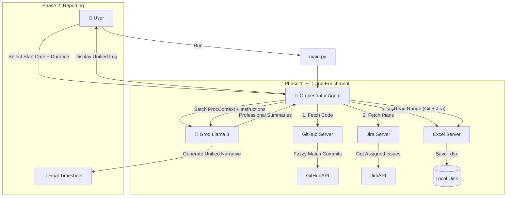

# 🤖 Timesheet Filling with MCP

> **Automate your timesheet creation using AI (GitHub + Jira).**
> This tool fetches your **GitHub code activity** AND your **Jira project plans**, enriches them with professional summaries, and generates a smart, gap-filling timesheet using the **Model Context Protocol (MCP)**.

---

## 📖 Overview

This project is a **Multi-Server MCP System** designed to solve the "Blank Timesheet Syndrome." It uses an **Orchestrator Agent** to coordinate between specialized tools and an LLM to produce high-quality corporate timesheets.

Unlike standard log dumpers, this tool:
1.  **Unifies Sources:** Merges technical work (GitHub Commits) with planning/tracking work (Jira Tickets & Worklogs).
2.  **Enriches Data:** Uses Llama 3 (via Groq) to rewrite "fix bug" into "Resolved critical validation errors."
3.  **Spreads Work:** If you only pushed code on Monday and Friday, the AI intelligently "spreads" that load across the week to simulate continuous progress.
4.  **Interactive:** Shows you the combined data log first, then lets you pick the specific start date and duration.

---

## 🏗️ Architecture & Flow

The system follows a **Microservices-like architecture** using the Model Context Protocol (MCP).

### The Workflow



📂 Project Structure

```text
mcp-timesheet/
├── .env                    # API Keys (GitHub, Jira, Groq)
├── server_config.json      # Registry/Configuration for MCP Servers
├── pyproject.toml          # Project dependencies (managed via uv)
├── main.py                 # Application Entry Point
└── src/
    ├── client.py           # The Orchestrator (LangGraph Agent logic)
    ├── state.py            # Shared State Schema
    └── servers/
        ├── github_server.py # FastMCP Server: Fetches GitHub Activity
        ├── jira_server.py   # FastMCP Server: Fetches Jira Issues
        └── excel_server.py  # FastMCP Server: Handles Excel I/O

```


🛠️ MCP Servers & Tools
This project runs 3 internal MCP Servers defined in server_config.json:

1. GitHub Server (github-tool)
Technology: FastMCP, PyGithub

Functionality: Scans all branches, performs fuzzy author matching (links local git name to GitHub username).

2. Jira Server (jira-tool)
Technology: FastMCP, jira-python

Functionality: Fetches issues assigned to you or where you logged work, ensuring planning tasks are captured.

3. Excel Server (excel-tool)
Technology: FastMCP, pandas, openpyxl

Functionality: Saves enriched data to separate sheets (Target_User_Activity and Jira_Activity) and reads them back for the LLM.
---

## 🚀 Installation & Setup

### Prerequisites

* **Python 3.10+**
* **uv** (The ultra-fast Python package manager)
  **Bash**

  ```
  # Install uv (Windows)
  powershell -c "irm [https://astral.sh/uv/install.ps1](https://astral.sh/uv/install.ps1) | iex"
  ```

### 1. Clone the Repository

**Bash**

```
git clone [https://github.com/YourUsername/mcp-timesheet-agent.git](https://github.com/YourUsername/mcp-timesheet-agent.git)
cd mcp-timesheet-agent
```

### 2. Configure Secrets

Create a `.env` file in the root directory:

# GitHub
GITHUB_TOKEN=ghp_your_token

# Jira
JIRA_URL=[https://your-domain.atlassian.net](https://your-domain.atlassian.net)
JIRA_EMAIL=your_email@example.com
JIRA_API_TOKEN=ATATT3... # Create at [https://id.atlassian.com/manage-profile/security/api-tokens](https://id.atlassian.com/manage-profile/security/api-tokens)

# AI
GROQ_API_KEY=gsk_your_key

### 3. Install Dependencies

**Bash**

```
uv sync
```

---

## 💻 Usage

Run the agent using `uv`. This automatically handles virtual environments and dependencies.

**Bash**

```
uv run main.py
```

Interactive Steps:
Enter Inputs:

GitHub Username & Repo (e.g., owner/repo).

Jira Project Key (e.g., PROJ1). Optional: Leave blank to skip Jira.

Processing:

The agent scans GitHub commits and enriches them.

The agent scans Jira for your recent tasks.

All data is saved to a local Excel file.

Review Log: The system prints the available date range found in your logs.

Generate Report:

Enter Start Date (e.g., 2024-02-10).

Enter Duration (e.g., 5 days).

Final Output: A unified markdown table combining Code + Plans into a single professional narrative.

🧠 Smart Features
"Work Spreading" Logic
Problem: Developers often code on Tuesday/Thursday but need to fill a Mon-Fri timesheet.

Solution: The agent treats your week's activity as a "Pool of Tasks." It intelligently distributes this work across your chosen duration to create a smooth, continuous narrative.

Unified Context
Problem: "Fixed bug" (Git) and "Jira-123: Login Error" (Jira) are the same task.

Solution: The AI reads both sources and consolidates them into one strong entry: "Resolved critical login authentication errors (Jira-123) by fixing the validation logic backend."
