# 🤖 AI GitHub Timesheet Agent (MCP Architecture)

> **Automate your timesheet creation using AI.** > This tool fetches your GitHub activity, enriches it with professional summaries, and generates a smart, gap-filling 5-day timesheet using the **Model Context Protocol (MCP)**.

---

## 📖 Overview

This project is not just a script; it is a **Multi-Server MCP System**. It uses an **Orchestrator Agent** (Client) to coordinate between specialized tools (Servers) and an LLM to produce high-quality corporate timesheets.

Unlike standard Git log dumpers, this tool:

1. **Scans Every Branch:** Finds hidden work in feature branches using fuzzy author matching.
2. **Enriches Data:** Uses Llama 3 (via Groq) to rewrite "fix bug" into "Resolved critical validation errors."
3. **Spreads Work:** If you only pushed code on Monday and Friday, the AI intelligently "spreads" that load across the week to create a continuous narrative for your timesheet.
4. **Interactive:** Shows you the data first, then lets you pick the specific week to report on.

---

## 🏗️ Architecture & Flow

The system follows a **Microservices-like architecture** using the Model Context Protocol (MCP).

### The Workflow

```mermaid
graph TD
    User["👤 User"] -->|Run| Main[main.py]
    Main --> Client["🤖 Orchestrator Agent"]

    subgraph Phase1 [Phase 1: ETL and Enrichment]
        Client -->|MCP Call| GH[GitHub Server]
        GH -->|Fetch Raw Commits| GitHubAPI
        Client -->|Batch Process| LLM["🧠 Groq Llama 3"]
        LLM -->|Professional Summaries| Client
        Client -->|MCP Call| XL[Excel Server]
        XL -->|Save .xlsx| Disk[("Local Disk")]
    end

    subgraph Phase2 [Phase 2: Reporting]
        Client -->|Display Data| User
        User -->|Select Start Date| Client
        Client -->|Read Range| XL
        Client -->|Context + Instructions| LLM
        LLM -->|Generate 5-Day Report| Output["📝 Final Timesheet"]
    end
```



📂 Project Structure

```text
mcp-timesheet/
├── .env                    # API Keys & Secrets (Git ignored)
├── server_config.json      # Registry/Configuration for MCP Servers
├── pyproject.toml          # Project dependencies (managed via uv)
├── main.py                 # Application Entry Point
└── src/
    ├── client.py           # The Orchestrator (LangGraph Agent logic)
    ├── state.py            # Shared State Schema for the Agent
    └── servers/
        ├── github_server.py # FastMCP Server: Fetches GitHub Activity
        └── excel_server.py  # FastMCP Server: Handles Excel I/O operations


## 🛠️ MCP Servers & Tools

This project runs **2 internal MCP Servers** defined in `server_config.json`:

### 1. GitHub Server (`github-tool`)

* **Technology:** `FastMCP`, `PyGithub`
* **Tool:** `fetch_github_activity`
* **Functionality:**
  * Scans all branches (not just main).
  * Deduplicates commits by SHA.
  * Performs **Fuzzy Matching** on author names (links "jdoe" to "John Doe").

### 2. Excel Server (`excel-tool`)

* **Technology:** `FastMCP`, `pandas`, `openpyxl`
* **Tools:**
  * `save_github_data_to_excel`: Saves enriched data.
  * `get_data_date_range`: Finds the min/max dates in the log.
  * `read_excel_summary`: Reads data for the LLM context.

---

## 🚀 Installation & Setup

### Prerequisites

* **Python 3.10+**
* **uv** (The ultra-fast Python package manager)
  **Bash**

  ```
  # Install uv (Windows)
  powershell -c "irm [https://astral.sh/uv/install.ps1](https://astral.sh/uv/install.ps1) | iex"
  ```

### 1. Clone the Repository

**Bash**

```
git clone [https://github.com/YourUsername/mcp-timesheet-agent.git](https://github.com/YourUsername/mcp-timesheet-agent.git)
cd mcp-timesheet-agent
```

### 2. Configure Secrets

Create a `.env` file in the root directory:

**Ini, TOML**

```
# Get this from [https://github.com/settings/tokens](https://github.com/settings/tokens)
GITHUB_TOKEN=ghp_your_github_token_here

# Get this from [https://console.groq.com/keys](https://console.groq.com/keys)
GROQ_API_KEY=gsk_your_groq_api_key_here
```

### 3. Install Dependencies

**Bash**

```
uv sync
```

---

## 💻 Usage

Run the agent using `uv`. This automatically handles virtual environments and dependencies.

**Bash**

```
uv run main.py
```

### Interactive Steps:

1. **Enter Inputs:** Provide your GitHub Username and the Repository name (e.g., `owner/repo`).
2. **Wait for Enrichment:** The agent will fetch commits and use the LLM to write a summary for each one.
3. **Review Data:** A table will appear showing your activity log.
4. **Generate Report:**
   * The system will show you the available date range (e.g., `2024-01-01 to 2024-02-15`).
   * Enter the **Start Date** for your timesheet (e.g., `2024-02-10`).
5. **Final Output:** A markdown table will be generated with 5 days of consolidated work descriptions.

---

## 🧠 Smart Features

### "Work Spreading" Logic

Timesheets often require an entry for every day (Mon-Fri), but developers don't push code every day.

* **Problem:** If you push 10 commits on Friday, Monday-Thursday looks empty.
* **Solution:** This agent treats your weekly commits as a "Pool of Tasks." It intelligently distributes the narrative across the 5 target days to simulate continuous progress (e.g., "Researching," "Designing," "Implementing").

### Token Optimization

* **Batch Processing:** Commits are sent to the LLM in batches of 10 for summarization, saving API calls.
* **Confirmation Gates:** The agent asks for confirmation before triggering the final (expensive) report generation.
