# 🤖 Timesheet Filling with MCP

> **Automate your timesheet creation using AI (GitHub + Jira).**
> This tool fetches your **GitHub code activity** AND your **Jira project plans**, enriches them with professional summaries, and generates a smart, gap-filling timesheet using the **Model Context Protocol (MCP)**.

---

## 📖 Overview

This project is a **Multi-Server MCP System** designed to solve the "Blank Timesheet Syndrome." It uses an **Orchestrator Agent** to coordinate between specialized tools and an LLM to produce high-quality corporate timesheets.

Unlike standard log dumpers, this tool:
1.  **Unifies Sources:** Merges technical work (GitHub Commits) with planning/tracking work (Jira Tickets & Worklogs).
2.  **Enriches Data:** Uses Llama 3 (via Groq) to rewrite "fix bug" into "Resolved critical validation errors."
3.  **Spreads Work:** If you only pushed code on Monday and Friday, the AI intelligently "spreads" that load across the week to simulate continuous progress.
4.  **Interactive:** Shows you the combined data log first, then lets you pick the specific start date and duration.

---

## 🏗️ Architecture & Flow

The system follows a **Microservices-like architecture** using the Model Context Protocol (MCP).

### The Workflow

```mermaid
graph TD
    User["👤 User"] -->|Run| Main[main.py]
    Main --> Client["🤖 Orchestrator Agent"]

    subgraph Phase1 [Phase 1: ETL and Enrichment]
        Client -->|"1. Fetch Code"| GH[GitHub Server]
        GH -->|"Fuzzy Match Commits"| GitHubAPI
        
        Client -->|"2. Fetch Plans"| JR[Jira Server]
        JR -->|"Get Assigned Issues"| JiraAPI
        
        Client -->|"Batch Process"| LLM["🧠 Groq Llama 3"]
        LLM -->|"Professional Summaries"| Client
        
        Client -->|"3. Save Data"| XL[Excel Server]
        XL -->|"Save .xlsx"| Disk[("Local Disk")]
    end

    subgraph Phase2 [Phase 2: Reporting]
        Client -->|"Display Unified Log"| User
        User -->|"Select Start Date + Duration"| Client
        Client -->|"Read Range (Git + Jira)"| XL
        Client -->|"Context + Instructions"| LLM
        LLM -->|"Generate Unified Narrative"| Output["📝 Final Timesheet"]
    end
```



📂 Project Structure

```text
mcp-timesheet/
├── .env                    # API Keys (GitHub, Jira, Groq)
├── server_config.json      # Registry/Configuration for MCP Servers
├── pyproject.toml          # Project dependencies (managed via uv)
├── main.py                 # Application Entry Point
└── src/
    ├── client.py           # The Orchestrator (LangGraph Agent logic)
    ├── state.py            # Shared State Schema
    └── servers/
        ├── github_server.py # FastMCP Server: Fetches GitHub Activity
        ├── jira_server.py   # FastMCP Server: Fetches Jira Issues
        └── excel_server.py  # FastMCP Server: Handles Excel I/O

```


🛠️ MCP Servers & Tools
This project runs 3 internal MCP Servers defined in server_config.json:

1. GitHub Server (github-tool)
Technology: FastMCP, PyGithub

Functionality: Scans all branches, performs fuzzy author matching (links local git name to GitHub username).

2. Jira Server (jira-tool)
Technology: FastMCP, jira-python

Functionality: Fetches issues assigned to you or where you logged work, ensuring planning tasks are captured.

3. Excel Server (excel-tool)
Technology: FastMCP, pandas, openpyxl

Functionality: Saves enriched data to separate sheets (Target_User_Activity and Jira_Activity) and reads them back for the LLM.
---

## 🚀 Installation & Setup

### Prerequisites

* **Python 3.10+**
* **uv** (The ultra-fast Python package manager)
  **Bash**

  ```
  # Install uv (Windows)
  powershell -c "irm [https://astral.sh/uv/install.ps1](https://astral.sh/uv/install.ps1) | iex"
  ```

### 1. Clone the Repository

**Bash**

```
git clone [https://github.com/YourUsername/mcp-timesheet-agent.git](https://github.com/YourUsername/mcp-timesheet-agent.git)
cd mcp-timesheet-agent
```

### 2. Configure Secrets

Create a `.env` file in the root directory:

# GitHub
GITHUB_TOKEN=ghp_your_token

# Jira
```text
JIRA_URL=[https://your-domain.atlassian.net](https://your-domain.atlassian.net)
JIRA_EMAIL=your_email@example.com
JIRA_API_TOKEN=ATATT3... # Create at [https://id.atlassian.com/manage-profile/security/api-tokens](https://id.atlassian.com/manage-profile/security/api-tokens)
```
# AI
GROQ_API_KEY=gsk_your_key

### 3. Install Dependencies

**Bash**

```
uv sync
```

---

## 💻 Usage

Run the agent using `uv`. This automatically handles virtual environments and dependencies.

**Bash**

```
uv run main.py
```

## 🛠 Interactive Workflow

1.  **Enter Inputs:**
    * **GitHub:** Provide Username & Repo (e.g., `owner/repo`).
    * **Jira (Optional):** Enter Project Key (e.g., `PROJ1`). Leave blank to skip.
2.  **Processing:**
    * The agent scans GitHub commits and enriches the data.
    * The agent scans Jira for your recent tasks.
    * All raw data is saved to a local Excel file for persistence.
3.  **Review Log:**
    * The system prints the available date range found in your logs to help you decide your report window.
4.  **Generate Report:**
    * **Start Date:** Enter your start point (e.g., `2024-02-10`).
    * **Duration:** Define the period (e.g., `5 days`).
5.  **Final Output:**
    * A unified markdown table combining **Code + Plans** into a single professional narrative.

---

## 🧠 Smart Features

### 🌊 "Work Spreading" Logic
> **Problem:** Developers often code intensely on specific days (e.g., Tuesday/Thursday) but need to fill a standard Monday–Friday timesheet.

**Solution:** The agent treats your week's activity as a **"Pool of Tasks."** It intelligently distributes this work across your chosen duration to create a smooth, continuous professional narrative, ensuring no "empty" days in your report.

### 🔗 Unified Context
> **Problem:** Disconnected logs like *"Fixed bug"* (Git) and *"Jira-123: Login Error"* (Jira) describe the same effort but look messy.

**Solution:** The AI cross-references both sources to consolidate them into a single, high-impact entry:
* *Before:* "Fixed bug" / "Jira-123: Login Error"
* *After:* **"Resolved critical login authentication errors (Jira-123) by fixing the validation logic backend."**
